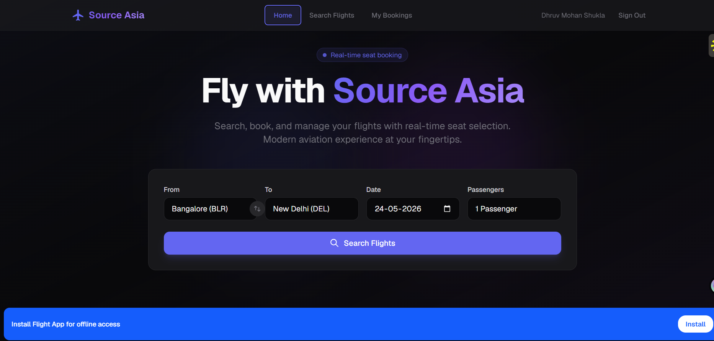
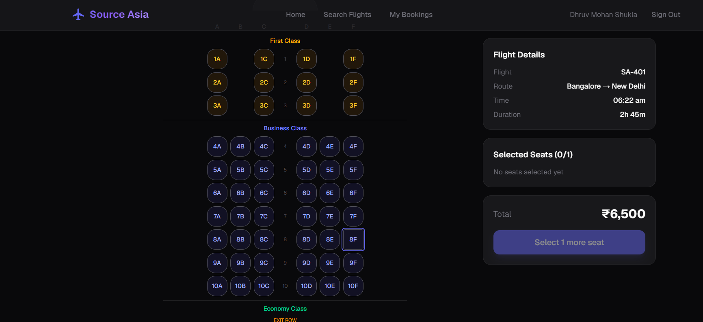
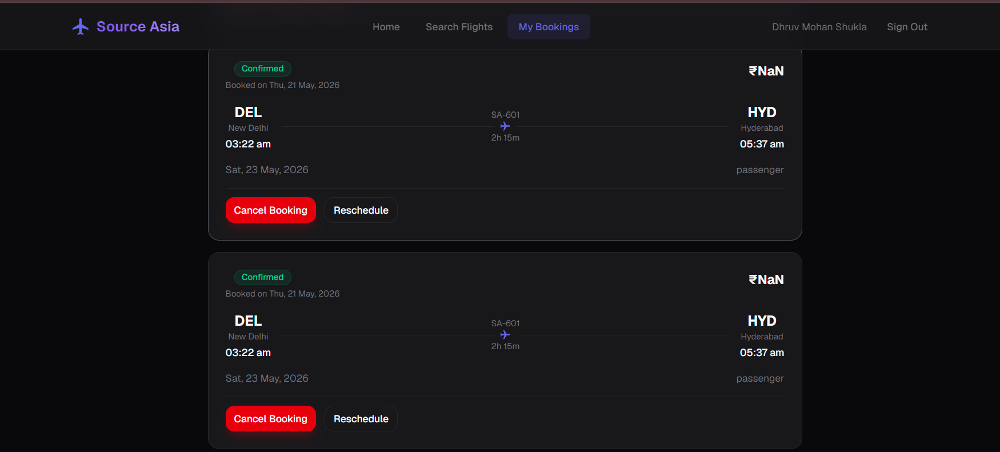

# ✈️ Source-Asia Flight Management App


---

## 📁 Repository

```bash
https://github.com/dhruvmohan867/source-asia
```

## 🔴 Live Demo

```bash
 https://source-asia-delta.vercel.app/
```

---

# 📌 Project Overview

Source-Asia Flight Management is a **production-grade, full-stack Progressive Web Application (PWA)** developed for the **Source Asia Frontend Internship Technical Assignment**.

The application simulates a real-world airline booking platform with:

- ✈️ Flight search
- 💺 Real-time seat selection
- 🔒 Concurrency-safe booking system
- 🎫 Atomic PostgreSQL transactions
- 🛡️ Backend-authoritative security
- 📱 Progressive Web App support
- ⚡ Optimistic UI updates
- 🔄 Flight rescheduling & cancellations

The architecture intentionally prioritizes:

- transaction consistency
- secure backend validation
- scalability
- realtime synchronization
- concurrency protection
- production-grade authorization

 ---

# 📸 Application Screenshots

## ✈️ Homepage




## 💺 Seat Map




## 🎫 Booking Dashboard



---

# 🚀 Features

## ✈️ Flight Search

- Search by:
  - origin
  - destination
  - departure date
  - passenger count
- Dynamic filtering
- Responsive search UI

---

## 💺 Interactive Real-Time Seat Map

- Visual aircraft cabin grid
- First / Business / Economy seat classes
- Live seat updates using Supabase Realtime
- Optimistic UI updates
- Real-time synchronization across users

### Seat Features

- Hover tooltips
- Occupied seat indicators
- Price modifiers
- Live seat locking
- Responsive mobile seat map

---

## 🔒 Concurrency-Safe Seat Locking

Uses PostgreSQL row locking:

```sql
FOR UPDATE SKIP LOCKED
```

to prevent:
- double bookings
- race conditions
- seat conflicts

### Locking Features

- 10-minute seat lock expiration
- automatic lock cleanup
- multi-user conflict handling
- backend lock validation

---

## 🎫 Atomic Booking Transactions

Bookings are handled entirely inside PostgreSQL RPC functions.

### Backend Transaction Responsibilities

- validate selected seats
- calculate secure pricing
- generate unique PNR
- insert passengers
- update seat inventory
- update flight availability
- commit transaction atomically

---

## 🔄 Booking Management

Users can:

- cancel bookings
- reschedule flights
- view booking history
- view booking statuses

All operations are:
- ownership validated
- transaction safe
- backend authorized

---

## 🛡️ Security Architecture

### Backend-Controlled Pricing

Frontend totals are NEVER trusted.

The backend:
- fetches actual flight base prices
- validates seat modifiers
- calculates final totals securely

Prevents:
- payload tampering
- checkout manipulation
- fake booking totals

---

### Secure Authorization with `auth.uid()`

All sensitive RPC functions derive identity using:

```sql
auth.uid()
```

instead of trusting frontend-provided user IDs.

Protected operations:
- create_booking
- lock_seat
- unlock_seat
- cancel_booking
- reschedule_booking

---

### Strict Row Level Security (RLS)

RLS policies ensure:
- users can only access their own bookings
- passenger ownership validation
- secure relational access
- no direct client-side trust

---

# 📱 Progressive Web App (PWA)

Implemented using:

```bash
next-pwa
```

### PWA Features

- installable application
- offline fallback support
- runtime caching
- mobile-friendly experience
- Lighthouse optimization
- standalone app mode

---

# 🧰 Tech Stack

| Technology | Purpose |
|---|---|
| Next.js 16 (App Router) | Frontend Framework |
| TypeScript | Type Safety |
| Supabase | Backend + Auth + Realtime |
| PostgreSQL | Database |
| Zustand | State Management |
| Tailwind CSS | Styling |
| next-pwa | Progressive Web App |
| Supabase Realtime | Live Seat Synchronization |

---


# 🧪 Race Condition Testing

To test concurrent booking protection:

1. Open two browser windows
2. Login using different accounts
3. Open the same flight
4. Attempt selecting the same seat simultaneously

### Expected Result

- First user successfully locks seat
- Second user receives lock conflict
- Realtime synchronization updates instantly

---

# 📋 Assignment Requirements Coverage

| Requirement | Status | Implementation |
|---|---|---|
| User Authentication | ✅ | Supabase Auth |
| Flight Search | ✅ | Dynamic filtering |
| Interactive Seat Map | ✅ | Responsive realtime seat grid |
| Real-Time Availability | ✅ | Supabase Realtime |
| Seat Locking | ✅ | PostgreSQL row locking |
| Passenger Form | ✅ | Fully validated flow |
| Booking & PNR | ✅ | Atomic RPC transaction |
| Cancel Booking | ✅ | Secure backend RPC |
| Reschedule Booking | ✅ | Backend transactional flow |
| My Bookings Dashboard | ✅ | Booking history management |
| Zustand Store Architecture | ✅ | Unified booking state |
| Sensitive Data Protection | ✅ | `partialize` excludes PII |
| PWA Support | ✅ | next-pwa integration |
| Offline Support | ✅ | Runtime caching |
| TypeScript Strictness | ✅ | Strongly typed architecture |
| Backend Pricing Security | ✅ | Server-side calculations |
| Secure Authorization | ✅ | `auth.uid()` validation |

---

# 🏗️ Architecture Overview

## Zustand State Management

### `useFlightStore`

Handles:
- search query
- selected flight
- selected seats
- booking progress
- passenger flow

Uses:
```ts
persist + partialize
```

to safely preserve booking progress while excluding sensitive passenger data.

---

## Why Passenger Data Is Excluded

Passenger data includes:
- passport numbers
- personally identifiable information

Sensitive data is intentionally excluded from localStorage to prevent:
- browser persistence leaks
- unauthorized access
- insecure storage practices

---

# ⚙️ Database Architecture

## Core Tables

| Table | Purpose |
|---|---|
| flights | Flight inventory |
| seats | Seat management |
| bookings | Booking records |
| passengers | Passenger details |
| booking_seats | Junction table |
| reschedules | Reschedule history |

---

# ⚡ PostgreSQL RPC Functions

## `lock_seat`

Handles:
- optimistic locking
- seat reservation
- anti-spam lock validation
- concurrent protection

---

## `unlock_seat`

Handles:
- ownership validation
- secure seat release

---

## `create_booking`

Atomic transaction:
- validates seats
- calculates pricing
- inserts passengers
- updates availability
- generates PNR

---

## `cancel_booking`

Handles:
- ownership verification
- seat release
- refund calculation
- inventory restoration

---

# 🔐 Security Highlights

## Backend-Authoritative Pricing

Frontend booking totals are ignored.

The backend securely calculates:
- flight base prices
- seat modifiers
- final totals

---

## Authorization Security

All secure RPCs derive identity using:

```sql
auth.uid()
```

instead of trusting frontend payloads.

---

## Concurrency Protection

Uses PostgreSQL locking:

```sql
FOR UPDATE SKIP LOCKED
```

to prevent:
- duplicate bookings
- race conditions
- seat conflicts

---

# 📱 PWA Features

Implemented with:

```bash
next-pwa
```

Includes:
- offline fallback pages
- runtime caching
- install prompt
- standalone mode
- mobile installability

---

# ⚙️ Local Setup

## 1️⃣ Clone Repository

```bash
git clone https://github.com/dhruvmohan867/source-asia.git
cd source-asia
```

---

## 2️⃣ Install Dependencies

```bash
npm install
```

---

## 3️⃣ Configure Environment Variables

Create:

```bash
.env.local
```

Example:

```env
NEXT_PUBLIC_SUPABASE_URL=your_project_url
NEXT_PUBLIC_SUPABASE_ANON_KEY=your_anon_key
```

---

# 🗄️ Supabase Setup

## Link Project

```bash
npx supabase login
npx supabase link --project-ref your_project_id
```

---

## Run Database Migrations

```bash
npx supabase db push
```

---

## Seed Database

```bash
npx supabase db reset
```

Seeds:
- flights
- seats
- bookings
- test users

---

# ▶️ Start Development Server

```bash
npm run dev
```

---

# 🧪 Production Testing Checklist

## Authentication

- [x] Login
- [x] Register
- [x] Session persistence

---

## Booking Flow

- [x] Flight search
- [x] Seat selection
- [x] Passenger forms
- [x] Booking creation
- [x] PNR generation

---

## Concurrency

- [x] Multi-user locking
- [x] Race-condition prevention
- [x] Realtime synchronization

---

## Booking Management

- [x] Cancel booking
- [x] Reschedule booking
- [x] Booking history

---

## PWA

- [x] Offline support
- [x] Install prompt
- [x] Lighthouse optimization

---

# ⚖️ Technical Trade-Offs & Future Improvements

## Payment Integration

Future implementation:
- Stripe integration
- webhook confirmation flow
- pending payment states

---

## Scheduled Lock Cleanup

Currently:
- expired locks release lazily

Future improvement:
- pg_cron scheduled cleanup

---

## Notification System

Potential improvements:
- booking emails
- cancellation notifications
- boarding reminders

---

# 👨‍💻 Developer Notes

This project intentionally prioritizes:

- backend correctness
- secure authorization
- transaction consistency
- concurrency handling
- production-grade architecture

over simple CRUD implementation.

The goal was to simulate:

```txt
real-world airline booking system behavior
```

rather than building a basic frontend assignment.

---

# 👨‍💻 Built By

## Dhruv Mohan Shukla

Built for the **Source Asia Frontend Internship Technical Assignment — 2026**